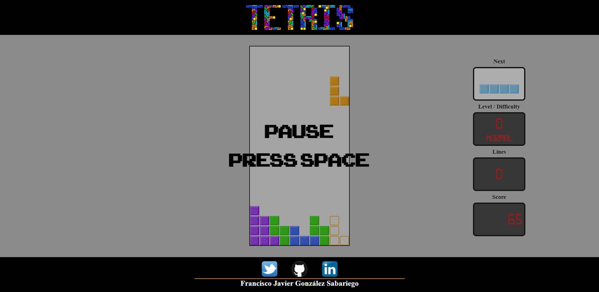
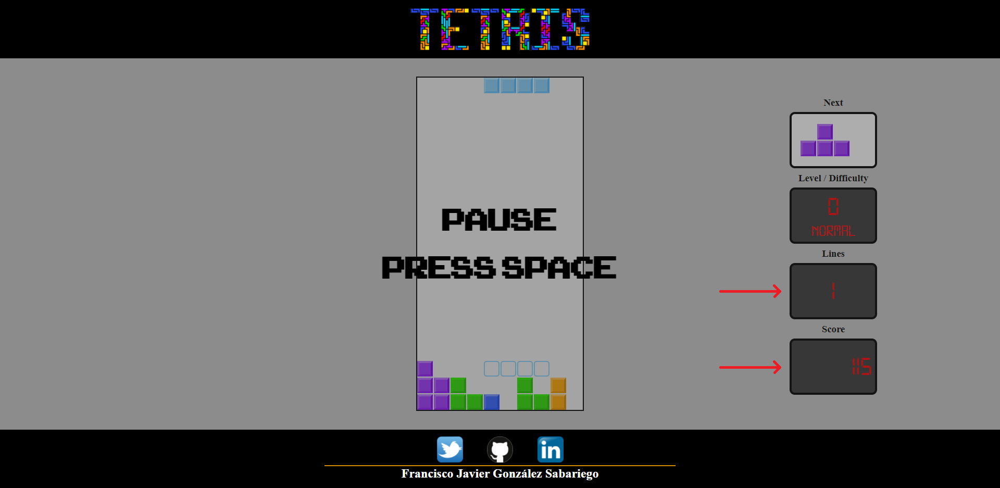
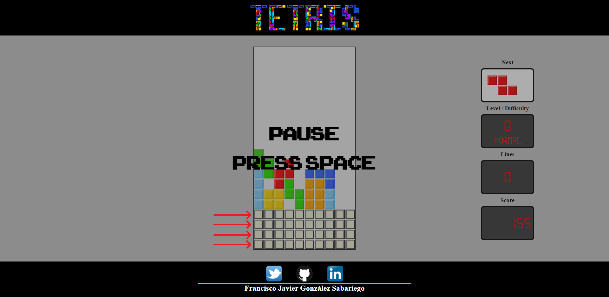
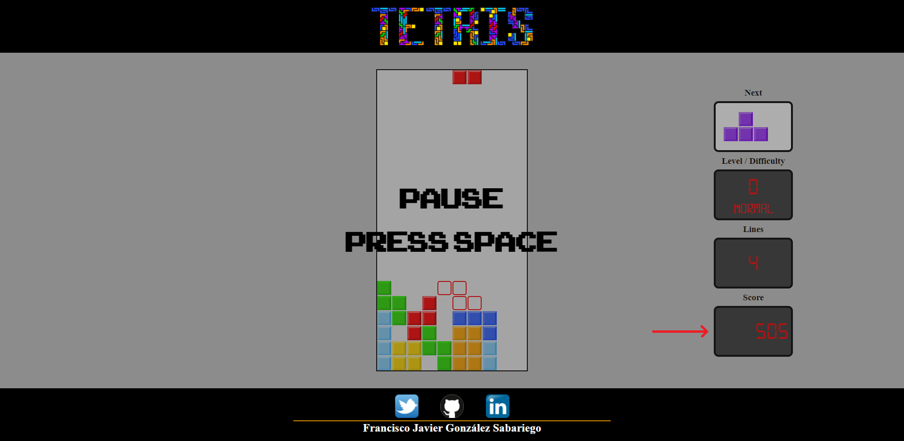
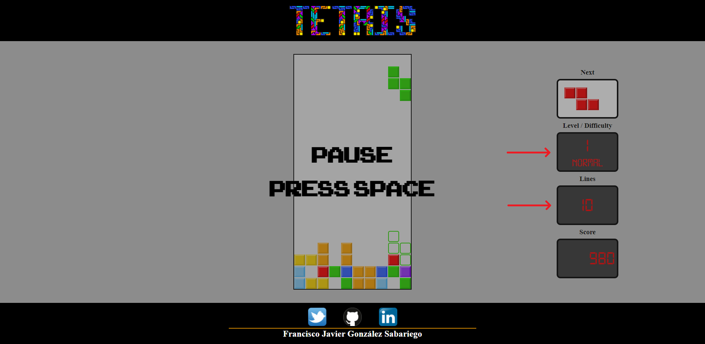

# :video_game: TETRIS :video_game:
## Autor: González Sabariego, Francisco Javier.

    
    

---

## Acceso al juego:

Puedes acceder a través del siguiente enlace: **[Juego del Tetris](https://fcojavierglez.github.io/tetris_js/)**.

    <b><u>Aviso importante</u>:</b> Actualmente el juego no funciona en los navegadores de Firefox. Es debido a que he usado métodos y atributos privados en clases declaradas con la palabra reservada 'class', y ésta característica es, en el momento de redactar este aviso, una característica en desarrollo y actualmente no implementada en los navegadores Firefox.

---

## Instrucciones:

### Controles:

- **Espacio:** Pausa / reanuda el juego.
- **Cursor arriba:** Rota la pieza 90 grados en sentido de las agujas del reloj.
- **Cursor abajo:** Baja la pieza más rápido y obten puntos extra al hacerlo.
- **Cursores laterales:** Desplaza la pieza hacia los lados.

### ¿Cómo se juega?:

    En el juego del Tetris debes combinar las piezas que van cayendo con el único objetivo de crear líneas completas y acumular el máximo número de puntos posibles antes de perder la partida.

  *Ejemplo de una línea completa.*
  *Aumento de puntos tras limpiar una línea.*

    Si eres capaz de completar más de una línea a la vez, por cada línea adicional, recibirás puntos extra. Si eliminas 4 líneas a la vez, lo que se denomina un Tetris, obtendrás la máxima puntuación posible para tu nivel (a más nivel más puntos por línea eliminada).

  *Ejemplo de un Tetris (completar 4 líneas a la vez).*
  *Eliminar más de una línea a la vez, siendo el Tetris el máximo, da muchos puntos.*

    Por cada 10 líneas que eliminas incrementas un nivel. A más nivel más puntos recibes, pero cuidado, porque igualmente irá incrementando la velocidad de juego. El nivel máximo alcanzable es el 20, para lo que tendrás que haber eliminado 200 líneas.

  *Incremento de nivel por cada 10 líneas eliminadas.*

    Si rebasas el tablero por la parte superior impidiendo a otras piezas aparecer perderás inmediatamente la partida. ¡Buena suerte!

  *Si alguna pieza queda bloqueada rebasando la parte superior del tablero la partida acabará inmediatamente.*
