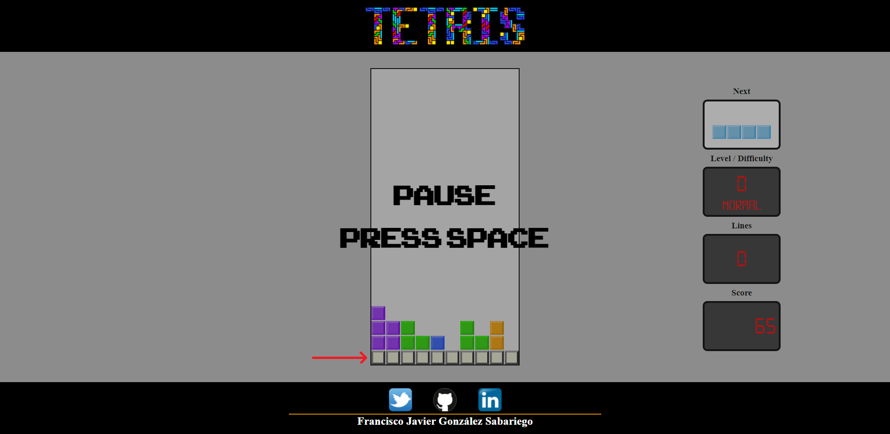

# :video_game: TETRIS :video_game:
## Autor: González Sabariego, Francisco Javier.

    
    

---

## Acceso al juego:

Puedes acceder a través del siguiente enlace: **[Juego del Tetris](https://fcojavierglez.github.io/tetris_js/)**.

    <b>Aviso importante:</b> Actualmente el juego no funciona en los navegadores de Firefox. Es debido a que he usado métodos y atributos privados en clases declaradas con la palabra reservada 'class', y ésta característica es, en el momento de redactar este aviso, una característica en desarrollo y actualmente no implementada en los navegadores Firefox.

## Instrucciones:

### Controles:

- **Espacio:** Pausa/reanuda el juego.
- **Cursores:** Desplaza la pieza actual hacia los lados, acelera su caída o rótala usando los cursores.

### ¿Cómo se juega?:

<!--    *Ejemplo de una partida en marcha.*

    En el juego de Snake <b>debes mover a tu serpiente en busca de alimento</b>. Por cada alimento ingierido acumulas puntos a la par que crece la serpiente.

  *Alimento especial.*

    <b>Cada cierto tiempo aparece un alimento especial, vale más puntos</b> que una comida normal, <b>¡¡si no te das prisa desaparecerá!!</b>

  *Se puede cruzar paredes.*

    <b>Cruza las paredes para aparecer en el extremo opuesto</b>, úsalo para moverte más rápido, te será útil.

  *Si la serpiente se muerde acaba la partida.*

    Cuanto más grande sea la serpiente más rápido se desplaza. <b>Debes tener cuidado de no chocarse consigo misma o la serpiente morirá haciéndote perder la partida</b>.

 -->
